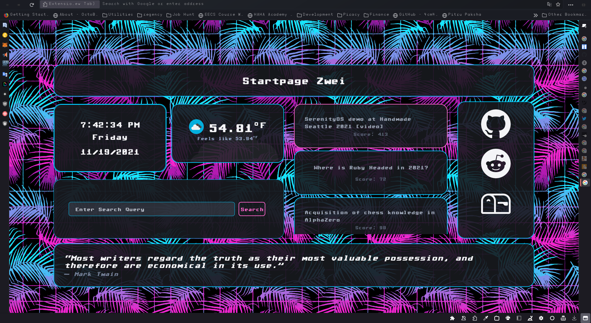

# Firefox 

## Wait, What is This?

What happened after too many hours helplessly using Firefox after one of the many examples of the Firefox team at Mozilla throwing a monkey wrench in my workflow. A totally customized, battered configuration of the Firefox browser, written with Linux in mind because I use Linux and think Chrome is inherently creepy and limiting (especially since finding userscript loaders that restore the userchromejs functionality of Linux geeking lore). As you can see from the screenshots above, the result of these efforts is a highly modified departure from Firefox's default UI named after subatomic particles (which one, I don't really care), which I have optimized to fit my idiosyncratic tastes and particular workflow using the browser. How this was achieved was on two fronts: 

## Topology of the Configuration

1. CSS - utilizing the built in, but disabled by default, legacy user style sheets functionality. There are two stylesheets included in this repo that style the interface 
    - userChrome - styles the browser window and that which is not the content of the document being displayed. This includes a lot of UI functionality changes that can be achieved with CSS alone, like hiding the tabs on top since I have an JS script providing me tabs on the side of the window. 
    - userContent -  styles the documents being displayed, be they the pages various add-ons bring up, firefox's garish internal pages or even various webpages that I don't want to spend hours burning my eyes away reading from their 1997 geocities blog format *cough* Wikipedia *cough*
2. Javascript - Using JS scripts that generally exceed the possibilities opened up by the web extensions API, these extend the browser in some meaningful way and often take the place of web extensions. In order to use these scripts, one must provide a series of files, some of which go into the program's directory system wide and others into the same directory within your browser profile and basically shim Firefox to load these scripts when booting up thus providing their functionality to you as you use the browser. 

## Design Considerations 

The following lists what I was thinking putting this all together in terms of how it would improve my workflow:

  - To the extent practical, limit the use of add-ons and instead try to bake the desired functionality into userChromeJS scripts as this minimizes attack surface in several ways while also making syncing for the first time much less annoying. 
  - Surround the window with additional panel bars, split up various buttons between them and isolate certain functions to certain panels. This means no annoying dropdown menus to search, no need to remember some features name at the critical moment, no odd looking margins like a side and top bar alone produce, name-day

## Why Don't You Use Chrome, Chromium, Brave or Opera
1&2 are Alphabet (aka Google) projects which already gets plenty of my data to sell to advertisers as is, using one of those browsers is giving them a license to creep harder. They also aren't so easily customized and the extension "web store" is even worse in its design than the PlayStore. 

Brave is just Chromium + insignificant crypto for dealing with adds. And when I tried to bare with it for the BAT, gemini canceled my account minutes after opening it for no apparent reason, so forget that.

Opera - I have tried, I just don't really get it 

Vivaldi - Its a much better, glorified variant of Chrome, even uses Google's web store for extensions, it just packs in too much in one place which I don't happen to really want or need. 

Epiphany - my secondary choice in terms of the modern desktop web browser. Go figure its a Gnome thing and features what most would need/want from their browser. f