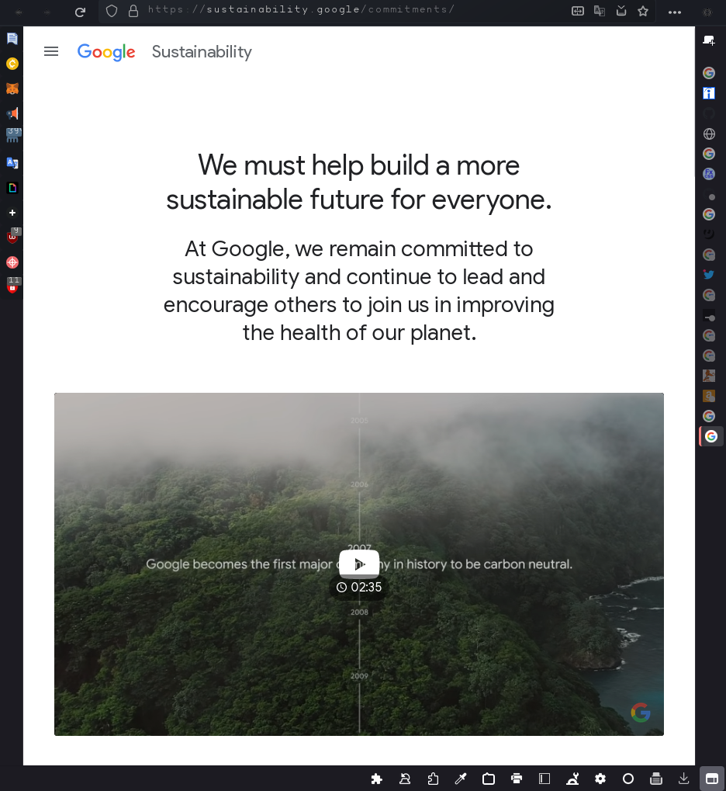

# Higgs Boson 

Among the protons, photons and other subatomic particles, this is the Higgs-Boson or as marketed by desperate physics departments as *the God Particle* which is a nickname I am so revolted by it continues the theme of my reaction to the subatomic particle naming convention used by Firefox UI branding pushes perfectly.   

As you will notice from the figures above and below, there are bars on all 4 sides of the browser window.

Handling the "tree style" tab manager in house, as opposed to an extension, makes for a much less frustrating styling experience, streamlined feature set free of the bloat that I'd rather not have bolted on and consistent in quality

## Wait, What is This?

The result of the open source software community relying on the frustration of those using software to drive its development by reaching frustration levels sufficient to fix whatever is spurring the agitation. However, my frustration was for want of screen real estate to put the icons that enable quick access to browser functionality or web extensions without having to crawl through the overflow menu to find what I need which is result of my idiosyncratic needs and not something upstream would even be able to do much with and not sufficiently variant to prompt a need to create another fork tracking upstream so it became some quick `userchrome.js` scripts that fit in nicely with my `userchrome.css` 

To load the userscripts, I have opted for the [Mr.OtherGuy autoconfig-fx userscript loader](https://github.com/MrOtherGuy/fx-autoconfig) due to the frontmatter like configuration in the script's header comment as well as my deep appreciation for the well documented explanations of the loader's provided API functions and especially the inclusion of a script toggle menu available via the tools dropdown that includes an option to clear the browser cache and restart it which eases the development hassle considerably. 

Scripts generally are either the unaltered original or a modified variant I have tried to remember to include the references to the original or inspiration for in a comment both for obvious purposes of crediting the author's work (and in some scripts, it helps make clear not all the rambling walls of text in this repo are examples of me engaging in my infamous attack of the flap trap, other even more tangential unstoppable forces of the bramble ramble royale lurk in the userchromejs world than even my bombastic soliloquies)

## Directory Topology of the Configuration

1. CSS - utilizing the built in, but disabled by default, legacy user style sheets functionality. There are two stylesheets included in this repo that style the interface
   - userChrome - styles the browser window and that which is not the content of the document being displayed. This includes a lot of UI functionality changes that can be achieved with CSS alone, like hiding the tabs on top since I have an JS script providing me tabs on the side of the window.
   - userContent - styles the documents being displayed, be they the pages various add-ons bring up, firefox's internal pages or even various webpages that I don't want to spend hours burning my eyes away reading from their 1997 geocities blog format _cough_ Wikipedia _cough_
2. Javascript - Using JS scripts that generally exceed the possibilities opened up by the web extensions API, these extend the browser in some meaningful way and often take the place of web extensions. In order to use these scripts, one must provide a series of files, some of which go into the program's directory system wide and others into the same directory within your browser profile and basically shim Firefox to load these scripts when booting up thus providing their functionality to you as you use the browser.

## Design Considerations

- surround workspace with customizable bars to place the icons revealing all my necessary or sometimes useful functionality on screen without digging through menus because I get distracted from that.
- remember it is Firefox and each update will mean needing to smack the thing with a wrench a few times before it will turn over thus retain awareness of when it updates 
- fit it into my awesomeWM theme as precisely as possible 
- Minimize distraction from the web content I am trying to work with or access
- 

## Script Loader

This customization uses `fx-autoconfig`'s userscript loader by MrOtherGuy, modified to include some funcitonality from XiaoXiao's userchrome.css loader in the `boot.jsm` file because that's the power of dealing with the code yourself. Only costs a few hairs turning gray.

## "Why Don't You Use Chrome, Chromium, Brave or Opera?"

### AKA Tom Quickly Reviews All Available Modern Web Browsers

- **Chrome** and **Chromium** are Alphabet (aka Google) projects which already gets plenty of my data to sell to advertisers as is, using one of those browsers is giving them a license to creep harder. They also aren't so easily customized and the extension "web store" is even worse in its design than the PlayStore, all of which make finding the extension or app you want obtuse and difficult while being distracted by slightly tangential choices that lead down rabbit holes leading to nowhere land. Not my style, I even install custom ROMs on my Android phones, I am not into selling my soul to Google. Though to be fair, other than privacy and customization issues, Google's browsers are highly functional and if you aren't hung up on one of my hangups or lack the stubbornness that masquerades as being "tech savvy" there is little reason to switch away from them if you use them (or even Ungoogled Chromium).

- **Edge** - I don't tend to use Microsoft products, but not because I am the typical Linux user with a bone to pick with Redmond, at least not anymore. Microsoft makes products that perform the intended tasks well enough, I just out grew them personally as they are not left as open to customization as Linux nor have the same application in server-side workflows that I tend towards these days. Edge, now a Chromium fork I have read, probably works well and supposedly my tab manager is very similar to its method of tab management. It can be installed on Linux, but I am not in a rush to `Redmondizing` my desktop Linux installations nor do I fancy Chromium so no thanks.

- **Brave** - seems interesting and I did get it to install on `void linux` and wrote a blog post about it even, but I can't bring myself to use it. For one, the crypto it generates is for watching ads, which some say is unavoidable but in my experience it is not, I barely see ads at this point of dialing in my adblockers and because I am living blissfully without the ad burden, I am not changing it for pennies of a crypto that isn't as exciting as it seems.

- **Opera** - I have tried, I just don't really get it and its basically Chrome. Maybe it works in some way I am missing, people I respect deeply absolutely love it but I just don't really see the point.

- **Vivaldi** - Its a much better, glorified variant of Chrome, even uses Google's web store for extensions, it just packs in too much in one place which I don't happen to really want or need. If I am getting that intimate in configuring something I want to put it on Github to spare me from needing to do it again anyway and find code a better medium to get precisely what I want than using a GUI which may or may not even allow me precisely what I am after.

- **Palemoon** - I have played around with it, since it uses the old Firefox extension engine which is pretty cool but I like my interface either to conform to my GTK theme or to look newer than 2003, neither is an option as far as I can tell with Palemoon. It also has some really toxic forum and subreddit cultures that I would rather stay out of, I get enough negativity in my life as it is, I don't need anymore. For potential users, it also has some compatiablity issues with modern websites (not shocking) that may inhibit your normal internet usage so be aware of that.

- **Basilisk** - formerly by the same developers as Pale Moon, but a more recent fork of Firefox than Pale Moon is based upon. I have used it, it worked well enough but its like using Firefox ESR, I do web dev and like new pretty things so its not exactly my style but far more useable (especially with captive portals actually).

- **Epiphany** - my secondary choice in terms of the modern desktop web browser. Go figure its a Gnome thing and features what most would need/want from their browser without being obtuse, it is out of place in the Gnome lineup but at least someone is making a browser like it.

- **Falkon** - Also very good, it has a few quirks I am not as much of a fan of (like handling of captive portals) but it is a functional and reasonable choice I would use if no other option presented itself.

- **Qutebrowser** - If I am going to even mess with a vim-like browser, the below option (Luakit) is more my style as it uses GTK and Lua (which I happen to be comfortable with) so I haven't dug deeply into a qutebrowser config to tell you one way or another how I feel about it, but I would assume its pretty good as it has a lot of users into the same depths of Linux as myself.

- **Luakit** - since I am not on the qt bandwagon (GTK4 might change this for me too I know already) I like having another configurable option, which is lightweight and obviously qutebrowser and the like are not my thing so I have luakit I am tinkering with when I get irritated with firefox or don't need to access Phantom wallet. Since I configure awesomewm and neovim in lua, what's another chance to use that language I so love to hate?
